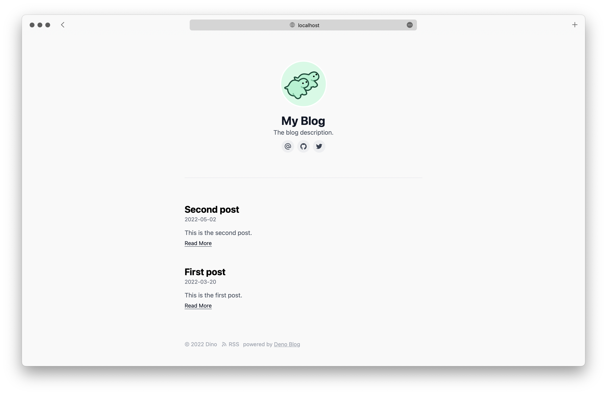

# Blog

Minimal boilerplate blogging. All you need is one boilerplate JavaScript file
that has 2 lines of code:

```js
import blog from "https://deno.land/x/blog/blog.tsx";

blog();
```

## Getting started

To initialize your own blog you can run following script:

```shellsession
$ deno run -r --allow-read --allow-write https://deno.land/x/blog/init.ts ./directory/for/blog/
```

_This command will setup a blog with a "Hello world" post so you can start
writing right away._

Start local server with live reload:

```shellsession
$ deno task dev
```

To ensure the best development experience, make sure to follow
[Set up your environment](https://deno.land/manual/getting_started/setup_your_environment)
from the Deno Manual.

## Configuration

You can customize your blog as follows:

```js
import blog, { ga, redirects } from "https://deno.land/x/blog/blog.tsx";
import { unocss_opts } from "./unocss.ts";

blog({
  author: "Dino",
  title: "My Blog",
  description: "The blog description.",
  avatar: "avatar.png",
  avatarClass: "rounded-full",
  links: [
    { title: "Email", url: "mailto:bot@deno.com" },
    { title: "GitHub", url: "https://github.com/denobot" },
    { title: "Twitter", url: "https://twitter.com/denobot" },
  ],
  lang: "en",
  dateStyle: "long", // localised format based on https://developer.mozilla.org/en-US/docs/Web/JavaScript/Reference/Global_Objects/Intl/DateTimeFormat
  middlewares: [
    ga("UA-XXXXXXXX-X"),
    redirects({
      "/foo": "/my_post",
      // you can skip leading slashes too
      "bar": "my_post2",
    }),
  ],
  unocss: unocss_opts, // check https://github.com/unocss/unocss
  favicon: "favicon.ico",
});
```



## Customize the header and footer

By default, we render the header and footer with builtin template using the blog
settings. You can customize them as follows:

```jsx
/** @jsx h */

import blog, { h } from "https://deno.land/x/blog/blog.tsx";

blog({
  title: "My Blog",
  header: <header>Your custom header</header>,
  showHeaderOnPostPage: true, // by default, the header will only show on home, set showHeaderOnPostPage to true to make it show on each post page
  section: <section>Your custom section</section>,
  footer: <footer>Your custom footer</footer>,
});
```

Beware to use `.tsx` extension to this extent.

## Hosting with Deno Deploy

To deploy the project to the live internet, you can use
[Deno Deploy](https://deno.com/deploy):

1. Push your project to GitHub.
2. [Create a Deno Deploy project](https://dash.deno.com/new).
3. [Link](https://deno.com/deploy/docs/projects#enabling) the Deno Deploy
   project to the `main.tsx` file in the root of the created repository.
4. The project will be deployed to a public `$project.deno.dev` subdomain.

## Self hosting

You can also self-host the blog, in such case run:

```shellsession
$ deno task serve
```
